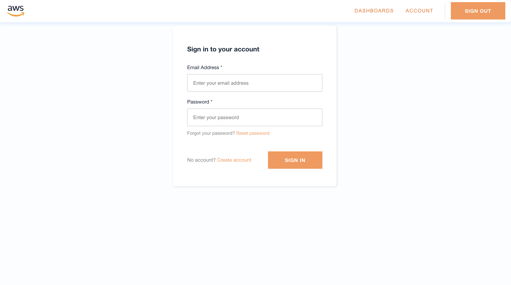
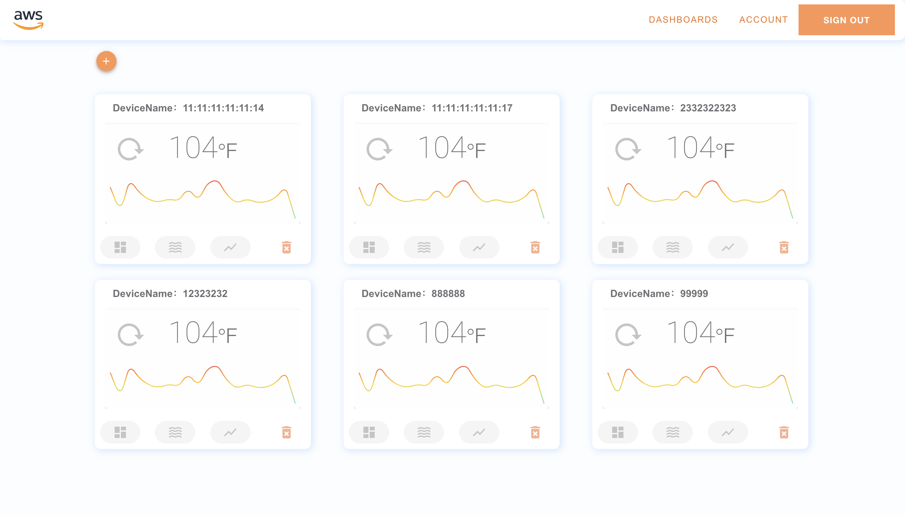
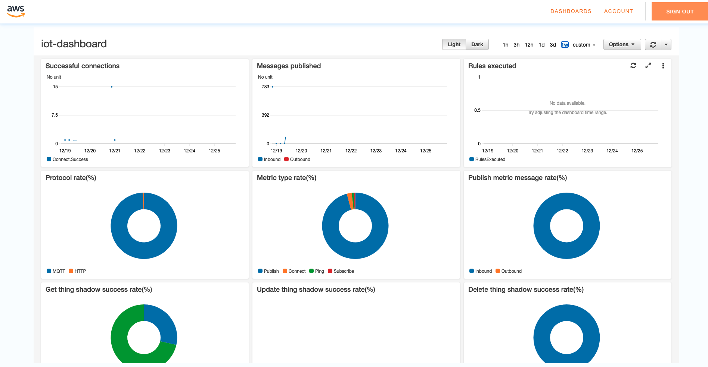

# aws-iot-console







## Project setup

```shell
    git clon https://github.com/Liberxue/aws-iot-console.git
```
```shell
    cd aws-iot-console
```

```shell
    yarn install
```

```shell
    amplify configure
```

```shell
    amplify init
```


### [REST API](https://docs.amplify.aws/lib/restapi/getting-started/q/platform/js/#configure-your-application)

```shell
amplify add api
```

### [analytics](https://docs.amplify.aws/lib/analytics/getting-started/q/platform/js/#configure-your-app)

```shell
amplify add analytics
```
### [Cognito Lambda](https://docs.amplify.aws/cli/function/#function-templates)

#### env 
```shell
var environment = process.env.ENV
var region = process.env.REGION
var apiBetatestGraphQLAPIIdOutput = process.env.API_BETATEST_GRAPHQLAPIIDOUTPUT
var apiBetatestGraphQLAPIEndpointOutput = process.env.API_BETATEST_GRAPHQLAPIENDPOINTOUTPUT
```

### [Authentication](https://docs.amplify.aws/cli/auth/overview/)


```shell
    amplify add auth
```

```shell
    amplify auth console

```


```shell
    amplify status

```

```shell
    amplify push
```

### Compiles and hot-reloads for development
```shell
    yarn serve
```

### Compiles and minifies for production

```shell
    yarn build
```

### Lints and fixes files
```shell
    yarn lint
```


### Destroy
#### Deletes all of the resources tied to the project from the cloud.   
```shell
    amplify delete
```

### Customize configuration
See [Configuration Reference](https://cli.vuejs.org/config/).
